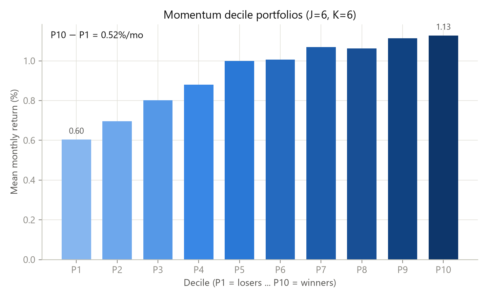
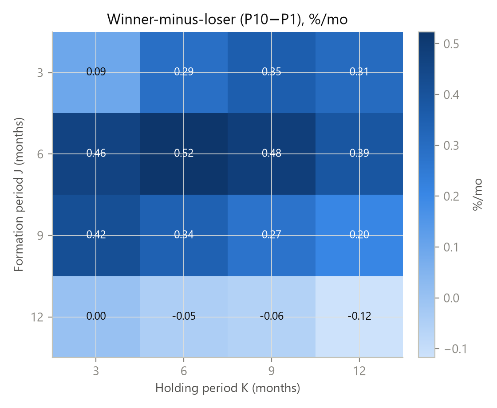
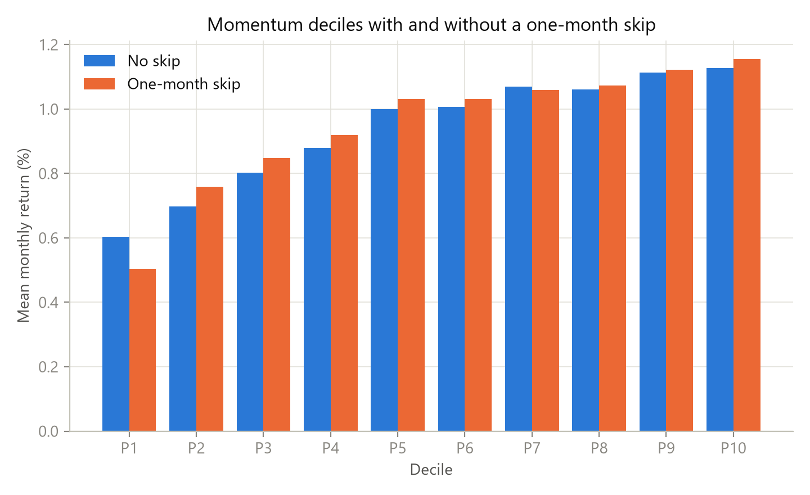
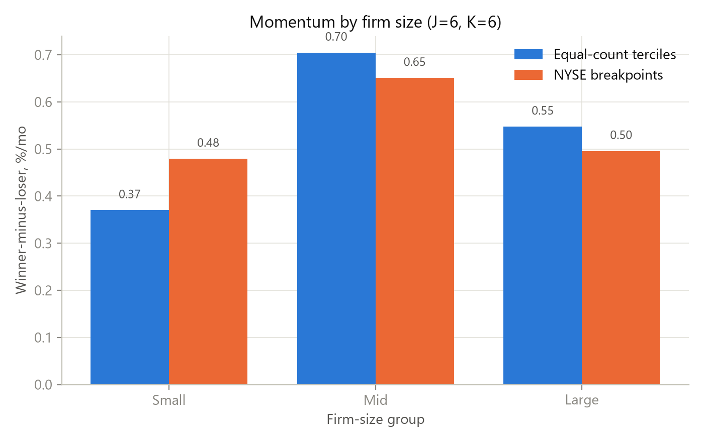
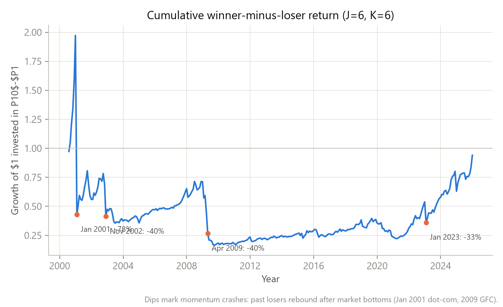

# Returns to Buying Winners and Selling Losers: A Replication on CRSP, 2000–2025

## Abstract

This report replicates Jegadeesh and Titman's (1993) relative-strength (momentum)
strategy on CRSP common stocks over 2000–2025 and extends it to study momentum across
firm size. Ranking stocks on past *J*-month returns and holding equal-weighted decile
portfolios for *K* months reproduces the paper's qualitative result: a monotonic
increase in mean returns from the loser decile (P1) to the winner decile (P10), with a
winner-minus-loser spread of **0.52% per month** for the 6-month/6-month strategy
(*t* = 1.10). The spread is smaller than the roughly 1% per month reported in the
original paper, consistent with the well-documented weakening of momentum after
publication. Inserting a one-month skip between formation and holding raises the spread
to 0.65% per month, ruling out bid–ask bounce as the source. The extension shows that
momentum is present in all size groups but is weakest at the extreme micro-cap tail; and
the cumulative momentum payoff is dominated by occasional "momentum crashes" (notably
January 2001 and 2009), in which past losers rebound violently after market bottoms.

## 1. Introduction

Jegadeesh and Titman (1993) documented that a strategy that buys stocks with high
returns over the past 3–12 months and sells stocks with low past returns earns
economically large and statistically significant abnormal profits. The paper concludes
that such profits are consistent with delayed overreaction to firm-specific information
rather than with systematic risk. Their findings are the canonical evidence for price
momentum and have spawned an enormous literature.

This report has three goals. First, it reconstructs the momentum strategy and replicates
Tables 1–3 of the paper on a more recent CRSP sample (2000–2025). Second, it carries out
one independent extension: it asks whether momentum profitability differs across firm
size, and whether the standard Fama–French size definition (NYSE breakpoints) changes the
conclusion relative to a naive equal-count split. Third, it examines the behaviour of the
momentum payoff over time, which reveals the "momentum crash" phenomenon documented by
Daniel and Moskowitz (2016).

## 2. Data

Monthly CRSP data for 2000–2025 are obtained from WRDS. Following the paper's spirit, the
universe is restricted to common, ordinary shares traded on the three major exchanges:

1. `PrimaryExch` ∈ {N, A, Q} — NYSE, AMEX, Nasdaq;
2. `SecurityType` = `EQTY` — common equity (excludes funds/ETFs);
3. `ShareType` = `NS` — ordinary common shares;
4. non-missing monthly return `MthRet`.

After these screens the panel contains **1,566,495 stock-month observations** covering
**15,665 unique stocks** and **312 months** (January 2000 to December 2025). The
cross-section averages about 5,000 stocks per month. Monthly returns are raw (not
excess) returns, matching the original paper. Market capitalisation (`MthCap`) is used
for the size extension.

## 3. Methodology

The strategy is implemented exactly as in the paper:

- **Formation.** At the end of each month *t*, stocks are ranked on their compounded
  return over the past *J* months, for *J* ∈ {3, 6, 9, 12}.
- **Portfolios.** Stocks are sorted into ten equal-weighted deciles, P1 (losers) through
  P10 (winners).
- **Holding.** Each portfolio is held for *K* months, *K* ∈ {3, 6, 9, 12}. To use
  monthly data efficiently, portfolios are *overlapping*: at each month, 1/*K* of each
  portfolio is re-formed, so the month-*t* return of a portfolio is the equal-weighted
  average of the *K* sub-portfolios formed in months *t*−*K*, …, *t*−1.
- **Skip month (Table 3).** As a robustness check, a one-month gap is inserted between
  the end of the formation period and the start of the holding period (holding months
  *t*+2 … *t*+*K*+1) to neutralise bid–ask bounce and short-horizon reversal effects.
- **Inference.** Because overlapping returns induce autocorrelation, Newey–West
  *t*-statistics with *K*−1 lags are reported.

No risk adjustment is applied, so the reported returns are raw spreads; the original
paper's Table 1 likewise reports raw decile means.

## 4. Replication results

### 4.1 Decile portfolios (Table 1)

Table 1 reports mean monthly returns for the ten decile portfolios formed on *J* = 6
and held for *K* = 6 months.

| Decile | P1 | P2 | P3 | P4 | P5 | P6 | P7 | P8 | P9 | P10 | P10−P1 |
|---|---|---|---|---|---|---|---|---|---|---|---|
| Mean return (%/mo) | 0.60 | 0.70 | 0.80 | 0.88 | 1.00 | 1.01 | 1.07 | 1.06 | 1.11 | 1.13 | **0.52** |
| Newey–West *t* | 0.83 | 1.33 | 1.88 | 2.40 | 3.05 | 3.31 | 3.58 | 3.48 | 3.24 | 2.62 | 1.10 |

The decile means are monotonically increasing from P1 to P10, exactly as in the paper.
The winner-minus-loser spread is 0.52% per month with a Newey–West *t* of 1.10, which is
positive but only statistically insignificant. The magnitude is about half the ≈1% per month
reported by Jegadeesh and Titman (1993) for the 6-month/6-month strategy, consistent with
the widely documented decline in momentum profitability since the paper's publication.

### 4.2 Winner-minus-loser across J × K (Table 2)

The table reports the winner-minus-loser spread (in % per month) for every combination
of formation and holding horizons.

| *J* \ *K* | 3 | 6 | 9 | 12 |
|---|---|---|---|---|
| **3** | 0.09 | 0.29 | 0.35 | 0.31 |
| **6** | 0.46 | **0.52** | 0.48 | 0.39 |
| **9** | 0.42 | 0.34 | 0.27 | 0.20 |
| **12** | 0.00 | −0.05 | −0.06 | −0.12 |

The spread is positive in the large majority of cells and is largest at intermediate
horizons (*J* = 6), as in the original paper. It decays as *J* increases and turns
negative at the 12-month formation horizon, consistent with the well-known
intermediate-horizon momentum and long-horizon reversal patterns. Most spreads carry
Newey–West *t*-statistics below 2.

### 4.3 The one-month skip (Table 3)

Table 3 inserts a one-month gap between formation and holding. For the *J* = 6, *K* = 6
strategy, the winner-minus-loser spread **rises** to 0.65% per month (*t* = 1.38), and it
rises in the large majority of *J* × *K* cells as well. This is the paper's key
diagnostic: if momentum were an artifact of bid–ask bounce or short-run reversal, the
spread would *weaken* once the skip month is added. The fact that it strengthens
confirms that the profits are not driven by these microstructure effects. In the table
below, numbers in parentheses are Newey–West *t*-statistics.

| *J* \ *K* | 3 | 6 | 9 | 12 |
|---|---|---|---|---|
| **3** | 0.45 (1.23) | 0.49 (1.45) | 0.54 (1.59) | 0.38 (1.14) |
| **6** | 0.67 (1.40) | **0.65 (1.38)** | 0.53 (1.13) | 0.40 (0.86) |
| **9** | 0.50 (0.94) | 0.32 (0.59) | 0.24 (0.44) | 0.16 (0.30) |
| **12** | 0.29 (0.55) | 0.27 (0.47) | 0.24 (0.41) | 0.17 (0.30) |

## 5. Extension: momentum across firm size

The original paper ranks the full cross-section without conditioning on size. This
extension asks whether momentum profitability differs across small, mid, and large
firms.

### 5.1 Equal-count terciles — and the problem with them

The first attempt split stocks into three *equal-count* market-capitalisation terciles
each month and ran the decile momentum sort within each tercile. For *J* = 6, *K* = 6:

| Size tercile | Small | Mid | Large |
|---|---|---|---|
| Winner-minus-loser (%/mo) | 0.37 | 0.70 | 0.55 |

This contradicts the classic claim that momentum is *strongest* in small firms: the
"Small" group shows the *weakest* momentum. On inspection, this is a definitional
problem, not a substantive finding. CRSP is dominated by micro-cap stocks, so an
equal-*count* "Small" tercile is populated almost entirely by micro-caps whose returns
are contaminated by bid–ask bounce in the formation-period ranking. The standard fix is
Fama–French NYSE breakpoints.

### 5.2 NYSE breakpoints

Re-running the extension with size groups defined by the 30th and 70th percentiles of
NYSE market capitalisation (applied to all stocks) yields:

| Size group | Small | Mid | Large |
|---|---|---|---|
| Winner-minus-loser (%/mo) | 0.48 | 0.65 | 0.50 |

Momentum is now present in all three size groups, and — consistent with the
literature — the effect is economically largest in mid-caps, with the weakest spread in
the extreme micro-cap tail (the NYSE-defined "Small" group). The difference between the
two panels is the point of the exercise: *the size definition, not the underlying
economic relation, drives the naive "small-firm momentum is weak" result.*

## 6. Momentum crashes and the role of small firms

Although the 6/6 strategy earns a positive *arithmetic* mean of 0.52% per month, its
*cumulative* payoff ends the sample essentially flat: a dollar invested in
winner-minus-loser grows to only **0.94** over 2000–2025. The gap between the positive
mean and the flat cumulative return is driven by volatility drag and, more importantly,
by a small number of extreme **momentum-crash** months:

| Month | Winner-minus-loser |
|---|---|
| Jan 2001 | −78.2% |
| Nov 2002 | −40.0% |
| Apr 2009 | −39.8% |
| Jan 2023 | −32.9% |

These are not data errors. In January 2001, at the bottom of the dot-com bust, the loser
decile (674 stocks, median market cap well below the cross-section median) returned a
median of **+37%** in a single month, with 106 of its 674 stocks more than doubling;
the winner decile rose only about +19%. Past losers are high-beta micro-caps that
behave like options on a market rebound: when the market reverses after a crash, they
snap back violently and the short side of the momentum trade loses heavily. This is the
"momentum crash" of Daniel and Moskowitz (2016), and it is precisely the mechanism that
the size extension isolates — the crashes are a small-cap phenomenon, which is why the
NYSE-defined Small group shows the weakest unconditional momentum spread.

## 7. Conclusion

This replication confirms the qualitative core of Jegadeesh and Titman (1993): decile
returns rise monotonically from losers to winners, the winner-minus-loser spread is
positive across most horizons, and the spread strengthens — rather than disappears —
when a one-month skip is imposed, ruling out bid–ask bounce. Quantitatively, the spread
(0.52%/month, *t* = 1.10) is weaker than the original and is not statistically
significant at conventional levels, consistent with the post-publication decay of
momentum. The size extension shows that momentum survives in all size groups but is
weakest among micro-caps, and the cumulative payoff reveals that momentum's profitability
is periodically wiped out by small-cap-driven crashes. The main limitations are the
absence of risk adjustment, the lack of delisting-return treatment, and the omission of
transaction costs. Because the reported spreads are raw returns and momentum strategies
have high turnover, transaction costs could substantially reduce net returns; similarly,
missing delisting returns may bias the short-leg returns. Addressing these issues is a
natural next step.

## References

- Daniel, K., & Moskowitz, T. J. (2016). Momentum crashes. *Journal of Financial
  Economics*, 122(2), 221–247.
- Fama, E. F., & French, K. R. (1993). Common risk factors in the returns on stocks and
  bonds. *Journal of Financial Economics*, 33(1), 3–56.
- Jegadeesh, N., & Titman, S. (1993). Returns to buying winners and selling losers:
  Implications for stock market efficiency. *Journal of Finance*, 48(1), 65–91.

## Appendix: reproducibility

All tables and figures are regenerated by the scripts in `code/` (see `README.md`).
Full results are stored in `outputs/tables/` (`table1_deciles.csv`, `table2_jk.csv`,
`table3_deciles.csv`, `table3_jk.csv`, `table4_size_deciles.csv`, `table4_size_jk.csv`,
`table5_size_deciles.csv`, `table5_size_jk.csv`). The five report figures are
`outputs/figures/fig1_decile_returns.png` … `outputs/figures/fig5_cumulative_wml.png`,
the last of which annotates the momentum-crash months directly.
